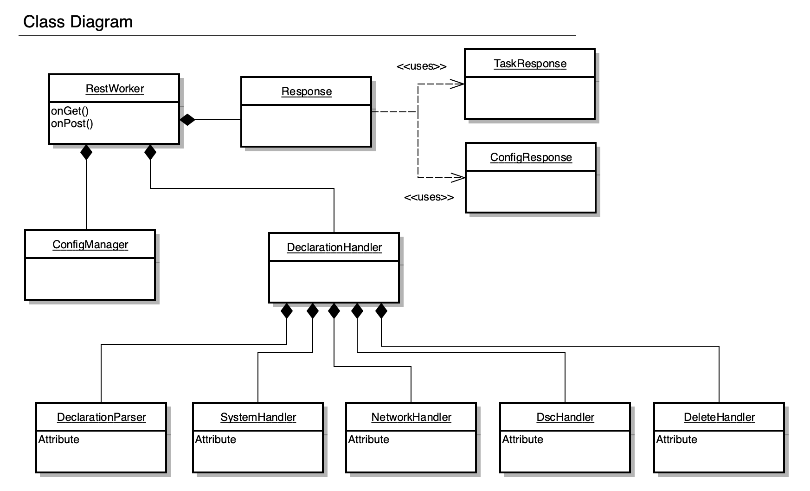

# Introduction

This is the top-level documentation which provides notes and information about contributing to this project.  It is broken down into a couple of key sections, listed below.

- [Overview](#overview)
- [Contributing](#contributing)

---
## Overview

The declarative onboarding system is an iControl LX extension which does basic onboarding (system, network and DSC configuration). It can be run directly
on a BIG-IP, as well as from BIG-IQ and the Application Services Gateway container.

---
### Class Diagram



---
### Anatomy of a Request

How does the project handle a typical `POST` request?

`POST /mgmt/shared/telemetry/declare`

```json
{
    "schemaVersion": "1.3.0",
    "class": "Device",
    "async": true,
    "label": "Basic onboarding",
    "Common": {
        "class": "Tenant",
        "hostname": "bigip.example.com",
        "myLicense": {
            "class": "License",
            "licenseType": "regKey",
            "regKey": "AAAAA-BBBBB-CCCCC-DDDDD-EEEEEEE"
        },
        "myDns": {
            "class": "DNS",
            "nameServers": [
                "8.8.8.8",
                "2001:4860:4860::8844"
            ],
            "search": [
                "f5.com"
            ]
        },
        "myNtp": {
            "class": "NTP",
            "servers": [
                "0.pool.ntp.org",
                "1.pool.ntp.org",
                "2.pool.ntp.org"
            ],
            "timezone": "UTC"
        },
        "root": {
            "class": "User",
            "userType": "root",
            "oldPassword": "default",
            "newPassword": "myNewPass1word"
        },
        "admin": {
            "class": "User",
            "userType": "regular",
            "password": "asdfjkl",
            "shell": "bash"
        },
        "guestUser": {
            "class": "User",
            "userType": "regular",
            "password": "guestNewPass1",
            "partitionAccess": {
                "Common": {
                    "role": "guest"
                }
            }
        },
        "anotherUser": {
            "class": "User",
            "userType": "regular",
            "password": "myPass1word",
            "shell": "none",
            "partitionAccess": {
                "all-partitions": {
                    "role": "guest"
                }
            }
        },
        "myProvisioning": {
            "class": "Provision",
            "ltm": "nominal",
            "gtm": "minimum"
        },
        "internal": {
            "class": "VLAN",
            "tag": 4093,
            "mtu": 1500,
            "interfaces": [
                {
                    "name": "1.2",
                    "tagged": true
                }
            ]
        },
        "internal-self": {
            "class": "SelfIp",
            "address": "10.10.0.100/24",
            "vlan": "internal",
            "allowService": "default",
            "trafficGroup": "traffic-group-local-only"
        },
        "external": {
            "class": "VLAN",
            "tag": 4094,
            "mtu": 1500,
            "interfaces": [
                {
                    "name": "1.1",
                    "tagged": true
                }
            ]
        },
        "external-self": {
            "class": "SelfIp",
            "address": "10.20.0.100/24",
            "vlan": "external",
            "allowService": "none",
            "trafficGroup": "traffic-group-local-only"
        },
        "default": {
            "class": "Route",
            "gw": "10.10.0.1",
            "network": "default",
            "mtu": 1500
        },
        "dbvars": {
        	"class": "DbVariables",
        	"ui.advisory.enabled": true,
        	"ui.advisory.color": "green",
        	"ui.advisory.text": "/Common/hostname"
        }
    }
}
```

*Response*:

```json
{
    "id": "fc89d5a0-7ac1-4783-b0a6-7dff24e149e3",
    "selfLink": "https://localhost/mgmt/shared/declarative-onboarding/task/fc89d5a0-7ac1-4783-b0a6-7dff24e149e3",
    "result": {
        "class": "Result",
        "code": 202,
        "status": "RUNNING",
        "message": "processing"
    },
    "declaration": {
    "schemaVersion": "1.3.0",
    "class": "Device",
    "async": true,
    "label": "Basic onboarding",
    "Common": {
        "class": "Tenant",
        "hostname": "bigip.example.com",
        "myLicense": {
            "class": "License",
            "licenseType": "regKey",
            "regKey": "AAAAA-BBBBB-CCCCC-DDDDD-EEEEEEE"
        },
        "myDns": {
            "class": "DNS",
            "nameServers": [
                "8.8.8.8",
                "2001:4860:4860::8844"
            ],
            "search": [
                "f5.com"
            ]
        },
        "myNtp": {
            "class": "NTP",
            "servers": [
                "0.pool.ntp.org",
                "1.pool.ntp.org",
                "2.pool.ntp.org"
            ],
            "timezone": "UTC"
        },
        "root": {
            "class": "User",
            "userType": "root",
            "oldPassword": "default"
        },
        "admin": {
            "class": "User",
            "userType": "regular",
            "shell": "bash"
        },
        "guestUser": {
            "class": "User",
            "userType": "regular",
            "partitionAccess": {
                "Common": {
                    "role": "guest"
                }
            }
        },
        "anotherUser": {
            "class": "User",
            "userType": "regular",
            "shell": "none",
            "partitionAccess": {
                "all-partitions": {
                    "role": "guest"
                }
            }
        },
        "myProvisioning": {
            "class": "Provision",
            "ltm": "nominal",
            "gtm": "minimum"
        },
        "internal": {
            "class": "VLAN",
            "tag": 4093,
            "mtu": 1500,
            "interfaces": [
                {
                    "name": "1.2",
                    "tagged": true
                }
            ]
        },
        "internal-self": {
            "class": "SelfIp",
            "address": "10.10.0.100/24",
            "vlan": "internal",
            "allowService": "default",
            "trafficGroup": "traffic-group-local-only"
        },
        "external": {
            "class": "VLAN",
            "tag": 4094,
            "mtu": 1500,
            "interfaces": [
                {
                    "name": "1.1",
                    "tagged": true
                }
            ]
        },
        "external-self": {
            "class": "SelfIp",
            "address": "10.20.0.100/24",
            "vlan": "external",
            "allowService": "none",
            "trafficGroup": "traffic-group-local-only"
        },
        "default": {
            "class": "Route",
            "gw": "10.10.0.1",
            "network": "default",
            "mtu": 1500
        },
        "dbvars": {
        	"class": "DbVariables",
        	"ui.advisory.enabled": true,
        	"ui.advisory.color": "green",
        	"ui.advisory.text": "/Common/hostname"
        }
    }
}
```

---
#### Anatomy of a Request (cont.)

What happens in the system internals between request and response?

- [RestWorker](../nodejs/restWorker.js) receives request which validates the declaration and assigns a task ID.
- Request is validated using JSON schema and AJV.
- If request is async, response is sent immediately after validation with a 202 status.
- Onboarding begins
    - Current configuration is determined and saved (in rest storage).
    - Processing is handed off to the [DeclarationHandler](../nodejs/declarationHandler.js).
    - [DeclarationHandler](../nodejs/declarationHandler.js)
        - Calls [DeclarationParser](../nodejs/declarationParser.js) to turn incoming declaration into a format for easier handling by pivoting into classes.
        - Applies any defaults for missing items to the declaration that is being processed.
        - Calculates differences between the existing configuration and the requested configuration using the [DiffHandler](../nodejs/diffHandler.js).
        - Hands off processing to the various subsystems.
            - [SystemHandler](../nodejs/systemHandler.js)
            - [NetworkHandler](../nodejs/networkHandler.js)
            - [DscHandler](../nodejs/dscHandler.js)
        - Deletes any items that need to be deleted by handing off to the [DeleteHandler](../nodejs/deleteHandler.js).
- After onboarding, if reboot is necessary, status is updated to indicate this and restWorker reboots the BIG-IP.
- On restWorker startup (after reboot), if status is found to be rebooting, status is updated to success.
- All configuration is handled via iControl REST.
- Heavy lifting provided by f5-cloud-libs.

---
## Contributing

Ok, overview done!  Now let's dive into the major areas to be aware of as a developer.

- [Core Modules](#core-modules)
- [Testing methodology](#testing-methodology)
- [Release methodology](#release-methodology)

---
### Core modules

All core modules are included inside `../nodejs/`

- [state.js](../nodejs/state.js)
    - Purpose: Holds the current state (current config, last declaration, etc) of all BIG-IP configured by DO.
- [restWorker.js](../nodejs/restWorker.js)
    - Purpose: Hook for incoming HTTP requests. Highlevel orchestration of request handling and reboot handling.
- [configManager.js](../nodejs/configManager.js)
    - Purpose: Collects the current configuration of the BIG-IP for everything that is in the DO domain.
    - Controlled by [configItems.json](../nodejs/configItems.json).
        - This is a DSL. See notes in the [configManager.js](../nodejs/configManager.js) ```get``` method for usage details.
- [declarationHandler.js](../nodejs/declarationHandler.js)
    - Purpose: Top-level coordinator of applying config to the BIG-IP.
    - Parses declaration and hands off to Handlers - one for each major subsystem, plus one to handle deletions.
- [systemHandler.js](../nodejs/systemHandler.js)
    - Purpose: sys module configuration and licensing.
- [networkHandler.js](../nodejs/networkHandler.js)
    - Purpose: net module configuration.
- [dscHandler.js](../nodejs/dscHandler.js)
    - Purpose: DSC (clustering) configuration and syncing.
- [deleteHandler.js](../nodejs/deleteHandler.js)
    - Prupose: Deletes items in the proper order.

---
### Testing methodology

- Unit tests are written using the [mocha](https://mochajs.org/) framework and run using ```npm run test```.
- Code coverage is done with the [Istanbul nyc](https://github.com/istanbuljs/nyc) framework and generated using ```npm run coverage```.
    - We aim for >90% coverage overall.
    - All new code should have at least 90% coverage.
- Functional testing is done on GitLab by launching BIG-IPs into VIO. These tests are run on a daily schedule by calling ```npm run functional```.
    - We need more functional testing!

---
### Release methodology

Build/publish makes heavy use of GitLab and [.gitlab-ci.yml](../.gitlab-ci.yml).  Check out CI file and GitLab documentation for more details.

- RPMs are generated for every push to GitLab.
- RPMs are pushed to Artifactory at f5-declarative-onboarding-rpm for every tag pushed to GitLab.
- When ready for release:
    - RPM should be manually copied into dist and pushed back up to GitLab. Please let's stop doing this.
    - RPM should be manually added to the F5 CDN. Please let's automate this.